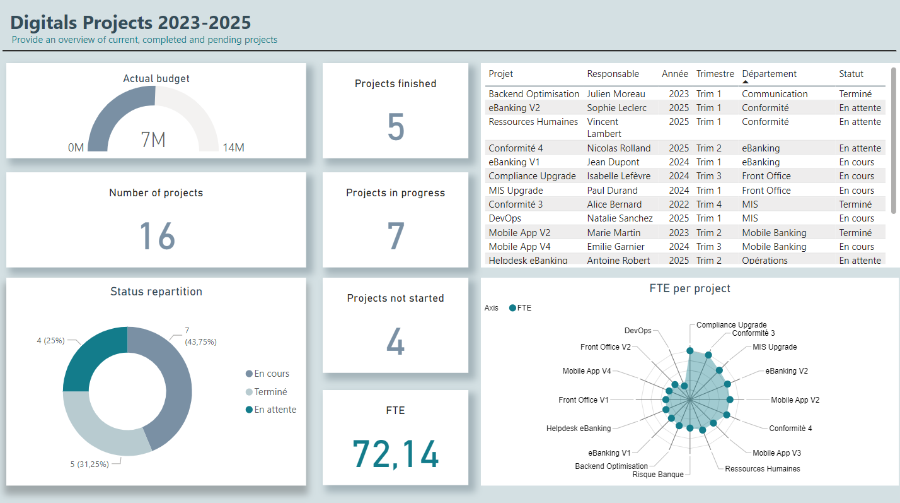
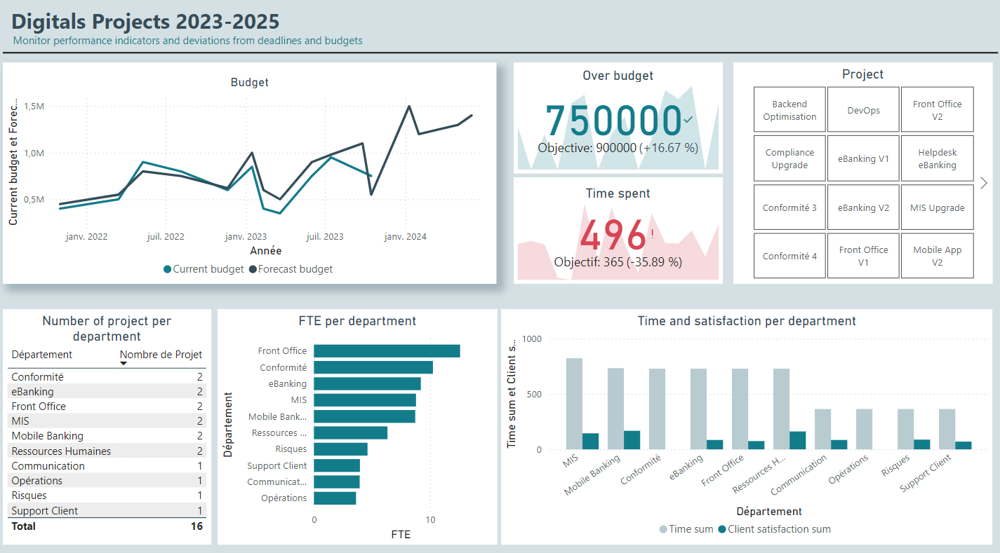

Ce mini-projet a pour objectif de réaliser un tableau de bord sur différents projets digitaux fictifs. 
Le data set a été généré par ChatGPT. Il inclut: 
- Le nom du projet
- Le statut
- La date de début et de fin prévue
- La date réelle de fin
- Le budget prévu et réel
- La satisfaction client %: optionnelle pour les projets en cours
- Le risque %: Évaluation du pourcentage de risque lié à chaque projet (problèmes de délais, dépassement de budget).
- Le délai
- Le temps passé
- L'effort
- Le responsable
- Le département
- FTE: calculé à partir de l'effort.
  
Dashboard de Suivi des Projets Digitaux
Page 1 : Vue Générale des Projets
Cette page fournit un aperçu global des projets en cours, terminés, et en attente. Elle inclut :

Une jauge du budget actuel par rapport aux prévisions.
Le nombre total de projets, répartis par statut (terminés, en cours, non démarrés).
Un radar pour visualiser les FTE (équivalents temps plein) par projet.
Un tableau récapitulatif affichant les principaux indicateurs des projets.

Page 2 : Suivi des KPI et Déviations La deuxième page permet d'analyser en profondeur les indicateurs de performance :

Un graphique en courbes pour comparer le budget courant au budget prévisionnel.
Un tableau montrant la répartition des projets et FTE par département.
Des indicateurs clés tels que le dépassement de budget, le temps passé par projet, et les délais.
Une mesure de la satisfaction par département, permettant d'identifier les zones à risque.

